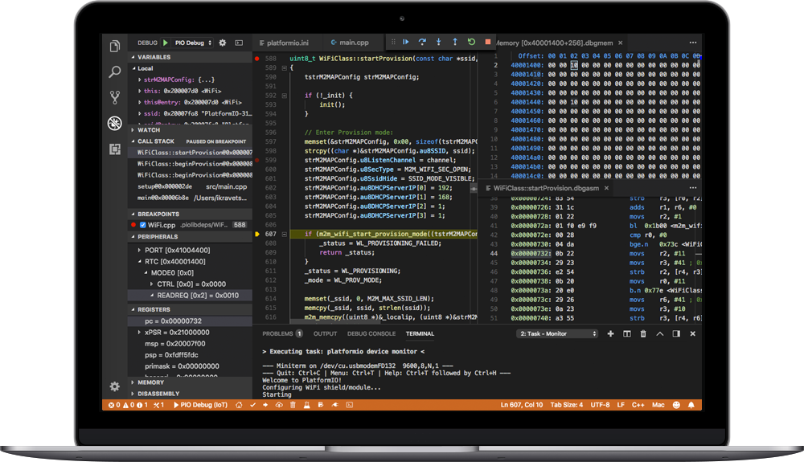

Hi there,

Welcome to Miles Oslo's IoT greenhouse project. This project is still a work in progress and is be no means close to being finished. We'll try to keep the diagrams updated as we go, so you can follow the progress more easily. 

## Tooling/Prerequisites

This project is based of the PlatformIO plugin in VS Code. To get quickly up and running download VS Code and install PlatformIO from the extensions tab.

For this project we are using the NodeMCUv2 board. To be able to communicate with the board, you will need to install a set of drivers.

[USB to UART Driver](https://www.silabs.com/products/development-tools/software/usb-to-uart-bridge-vcp-drivers)

That should be it really, we have added all our dependencies to the platformio.ini file and they should be automatically downloaded once the project gets built.

## Wiring

Bellow you will find how to wire up the DHT- and soil moisture-sensor. We have utilized D0 for the DHT input data and A0 for the soil moisture.

## Source files

You fill find the source code under [src/main.cpp](src/main.cpp)

All diagrams are made using Fritzing. The Fritzing files and parts can be found under [diagrams](diagrams)

## Blynk/WIFI

We are currently using Blynk for means of visualizing the output from the various sensors. To utilize this you will need to download the Blynk app on your phone and create a profile and a project. After you have created your project; input the token received into the <code>blynk_token</code> variable.

Blynk needs access to the interwebz to upload data, and since the NodeMCU ships with a built in wifi-contoller, all you need to do is input ssid/pass into the <code>ssid</code> & <code>pass</code> variables.

The various outputs can also be read through PlatformIOs <code>Serial Monitor</code> for easier debugging.

